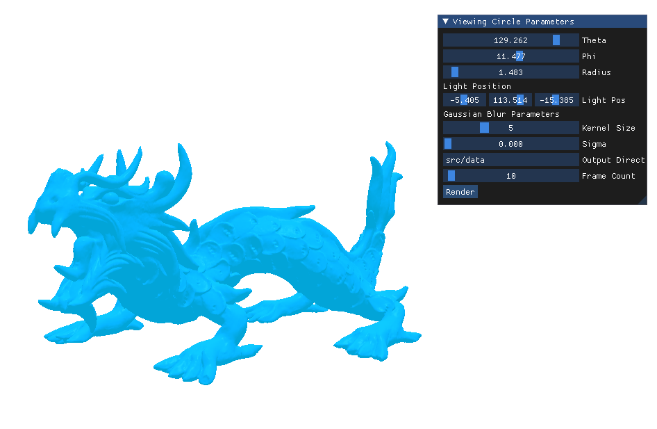
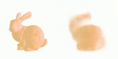

# NeRF-at-home

This project loads and renders a .OBJ models using OpenGL with Phong shading. It allows for interactive viewing, data generation and video rendering for Neural Rendering testing with customizable parameters. This repository also includes as custom implementation of NeRF in PyTorch. This code has only been tested on Ubuntu 22.04 with Nvidia GTX 1650 Ti.




## Setup

1. Clone the repository:
    ```bash
    git clone https://github.com/vishweshvhavle/NeRF-at-home.git
    cd NeRF-at-home
    ```

2. Create an Anaconda Environment:
    ```bash
    conda create -n nerfathome python=3.9.12
    conda activate nerfathome
    ```

3. Install dependencies:
    ```bash
    conda install conda-forge::cudatoolkit-dev=11.7.0
    pip install -r requirements.txt
    conda install -c conda-forge mesa libgl1-mesa-glx
    conda install -c conda-forge glfw
    conda install pytorch==2.0.0 torchvision==0.15.0 pytorch-cuda=11.7 -c pytorch -c nvidia
    ```

4. Run the data generator script for the NeRF data:
    ```bash
    python src/data_generator.py
    ```
    The generated data will have a directory structure like:
    ```bash
    src/
    └── data/
        └── <obj_model_name>_<timestamp>/
            ├── frames/
            │   ├── frame_0000.png
            │   ├── frame_0001.png
            │   └── ...
            ├── pose.json
            └── video_<obj_model_name>_<timestamp>.mp4
    ```

5. Run NeRF:
    ```bash
    python src/run_nerf.py
    ```
    This will create directories for model checkpoints and output results:
    ```bash
    src/
    └── models/
        ├── model_1000.pth
        ├── model_2000.pth
        └── ...
    └── output/
        ├── result_0000.png
        ├── result_0001.png
        └── ...
    ```

## Data Generation

You can run the script with various command-line arguments to customize the rendering:

```bash
python src/data_generator.py [OPTIONS]
```

### Options:

- `--obj_model`: Path to the OBJ model file (default: "src/assets/bunny.obj")
- `--axis`: Axis to rotate the model along
- `--angle`: Angle to rotate the model
- `--scale`: Scale for OBJ model file
- `--theta`: Initial theta angle for viewing circle (default: 0.0)
- `--phi`: Initial phi angle for viewing circle (default: 0.0)
- `--radius`: Initial radius for viewing circle (default: 5.0)
- `--kernel_size`: Kernel size for Gaussian blur (default: 5)
- `--sigma`: Sigma value for Gaussian blur (default: 0.0)
- `--output_dir`: Output directory for rendered frames with poses and videos (default: "src/data")
- `--fps`: Frames per second for rendered frames with poses and videos (default: 30)
- `--vertex_shader`: Path to vertex shader file (default: "src/shaders/vertex_shader.glsl")
- `--fragment_shader`: Path to fragment shader file (default: "src/shaders/fragment_shader.glsl")

### Example:

```bash
python src/data_generator.py --obj_model "path/to/model.obj" --theta 45 --phi 30 --radius 7 --kernel_size 7 --sigma 1.5 --output_dir "path/to/output"
python src/data_generator.py --obj_model src/assets/hotdog.obj --axis 1 0 0 --angle 270 --scale 0.8
python python src/data_generator.py --obj_model src/assets/buddha.obj --axis 1 0 0 --angle 270
```

### Interactive GUI for Data Generation with Poses from 

The application provides an interactive GUI where you can adjust various parameters in real-time:

- Viewing Circle Parameters: Theta, Phi, and Radius
- Gaussian Blur Parameters: Kernel Size and Sigma
- Output Directory
- Rendering FPS

You can also trigger video rendering from within the GUI.

## Run NeRF
You can run the NeRF implementation with various command-line arguments to customize the training and testing process:

```bash
python src/run_nerf.py [OPTIONS]
```
### Options:
- `--iterations`: Number of iterations for training (default: 250)
- `--train`: Flag to indicate training mode
- `--test`: Flag to indicate test mode
- `--output_dir`: Directory to store outputs (default: "src/output")
- `--model_dir`: Directory to store model checkpoints (default: "src/models")
- `--data_path`: Path to the dataset (required)

### Modes:

Training Mode:

```bash
python src/run_nerf.py --train --iterations 250 --data_path src/data/my_dataset --output_dir results --model_dir checkpoints
```

Testing Mode:

```bash
python src/run_nerf.py --test --data_path src/data/my_dataset --model_dir checkpoints
```

## Directory Structure

- `src/`: Main source code
  - `assets/`: 3D models and material files
  - `shaders/`: GLSL shader files
  - `data/`: Default directory for rendered videos and frames
  - `model/`: Default directory for model checkpoints
  - `output/`: Default directory for output of novel views
- `imgs/`: Images for the README.md

## License

This project is licensed under the MIT License - see the [LICENSE](LICENSE) file for details.

## Acknowledgments

- OpenGL for 3D rendering
- Dear ImGui for the graphical user interface
- Stanford Computer Graphics Laboratory for the bunny and dragon model
- NeRF: Representing Scenes as Neural Radiance Fields for View Synthesis (2020)

# Citation

If you find this code useful for your research, please consider citing:

```
@misc{alfred_2024,
  author       = {Vishwesh Vhavle},
  title        = {NeRF-at-home},
  year         = {2024},
  url          = {https://github.com/vishweshvhavle/NeRF-at-home},
  note         = {Version 1.0.0}
}

```
